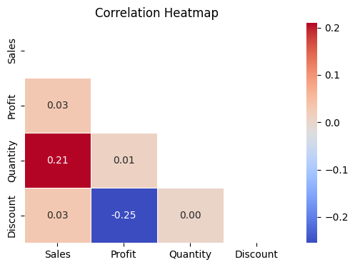
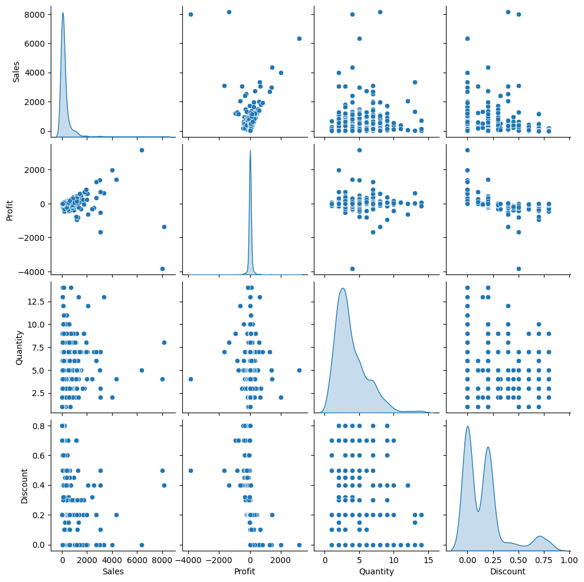

# Correlation Heatmap & Pairwise Relationship Analysis

---

## Project Work Done By
**Mahrin Jawwad Arab**  

---

## Project Overview

A data analysis project exploring relationships between numerical variables 
in the Superstore dataset using correlation analysis and visualization techniques.

---

##  Project Visualizations

### Correlation Heatmap

### Pairplot Analysis

---

## Dataset used 

The project uses the Superstore Sales Dataset, which contains transactional sales data including product sales, profit, quantity, and discount information.

Key variables used in this analysis:
Sales – Total revenue generated from transactions
Profit – Profit earned from sales
Quantity – Number of products sold
Discount – Discount applied to products

---

## Tools & Technologies

The following Python libraries were used for the analysis:
Python
Pandas – Data manipulation and analysis
Seaborn – Statistical data visualization
Matplotlib – Graph plotting
NumPy – Numerical operations

---

## Project Steps

- Data Loading
The Superstore dataset is loaded using Pandas.
- Feature Selection
Numerical variables (Sales, Profit, Quantity, Discount) are selected for correlation analysis.
- Correlation Matrix Calculation
Pearson correlation is computed to measure the strength and direction of relationships between variables.
- Heatmap Visualization
A correlation heatmap is generated to visually represent relationships between variables.
- Pairwise Relationship Analysis
Pairplots are used to analyze pairwise relationships and distributions between variables.

---

## Key Insights

- Sales and Profit show a positive correlation, indicating that higher sales generally lead to higher profit.
- Discount and Profit show a negative relationship, suggesting that larger discounts may reduce profitability.
- Quantity has moderate relationships with other variables depending on transaction patterns.

---

## Conclusion

This project demonstrates how correlation analysis and visualization techniques can be used to understand relationships between variables in a dataset. 
Such insights can help businesses identify patterns that influence profitability and sales performance.
